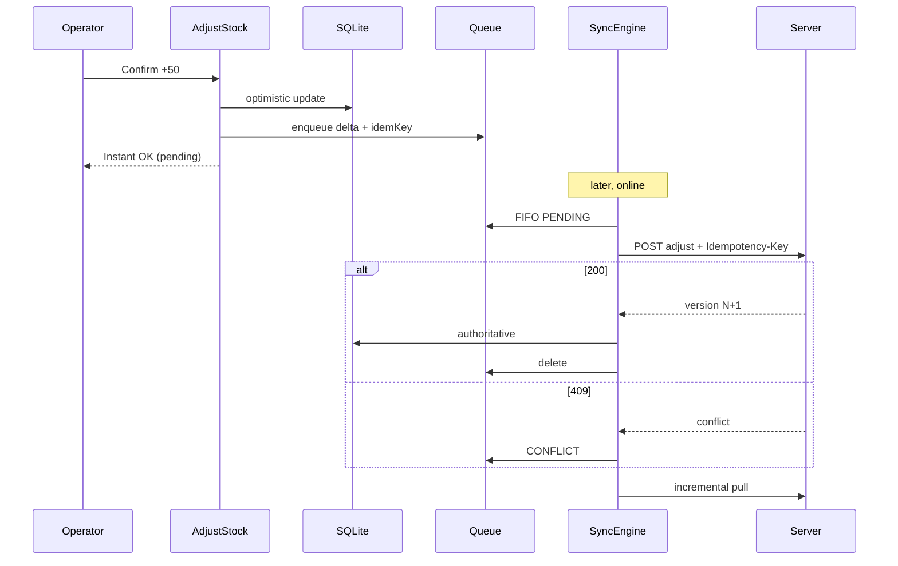

# Stockwell Mobile

Offline-first React Native client for the **Stockwell** multi-tenant warehouse inventory API.

**Target user:** warehouse operators — gloves, glare, cheap devices, and Wi-Fi that claims to be connected when it is not. The UI is built for that context, not for a dashboard viewer at a desk.

**Application ID:** `jo.alloussi.stockwell`  
**Play Store:** _pending production access (M-32)_ · see [docs/production-access.md](docs/production-access.md)  
**Backend:** Stockwell API (Project 1) — link your API repo here when published.

---

## Why this exists

Warehouse stock moves in dead zones. A client that blocks on the network forces operators to invent paper workarounds. Stockwell treats **SQLite as the read source of truth**, queues every mutation with a **client-generated idempotency key**, and syncs when the radio cooperates.

The server contract was designed for this client: unique `(tenant, key, endpoint)` idempotency, optimistic locking (`version` → 409), and `updated_at` cursors for incremental pull. The portfolio sentence:

> *"I designed the server's idempotency contract because I knew a mobile client would be replaying an offline queue."*

---

## Features

- Offline inventory list (FlashList + SQL-side search/sort)
- Adjust stock with optimistic UI (&lt;100 ms offline path)
- Mutation queue + sync engine (**push before pull**)
- Sync centre (pending / failed / conflict / dead-letter)
- Manual conflict resolution for stock (deltas, not absolutes)
- Barcode scan + **manual SKU fallback**
- Biometric unlock · light/dark themes · Sentry (PII scrubbed)

---

## Architecture

```
Presentation → Application → Domain ← Data / Infrastructure
                              ↑
                         sync/ (top-level)
```

| Area | Choice | Why |
|---|---|---|
| Local DB | op-sqlite + Drizzle | Build the sync engine ourselves (portfolio argument) |
| Server state | TanStack Query | Never mirror into Zustand |
| Client state | Zustand (session / theme / syncStatus) | Three slices only |
| Tokens | Keychain only | Never MMKV / SQLite |
| Sync | Command queue + state machine | Resumable; background not assumed |

See [docs/architecture.md](docs/architecture.md) and [docs/adr/](docs/adr/).

### Offline sync (push before pull)



---

## Folder structure

```
src/
  app/           bootstrap, providers
  core/          Result, DI, errors
  features/      auth · warehouses · inventory
  sync/          queue · engine · pull · conflict
  services/      api · auth · network · crash · logging
  storage/       db · keychain · mmkv
  ui/            design system (no domain)
  navigation/
```

---

## Setup

```bash
# Node ≥ 20.19.4 (or 22+)
cp .env.example .env
npm ci
npm start
npm run android
```

### Env (`.env` — never commit secrets)

| Variable | Purpose |
|---|---|
| `API_BASE_URL` | Stockwell API base |
| `SENTRY_DSN` | Empty disables Sentry |
| `ENV` | `development` \| `staging` \| `production` |

---

## Tests

```bash
npm test
npm run test:coverage
npm run test:offline-sync   # five mandatory suites
npm run typecheck
npm run lint
npm run deps:cruise
npm run contrast
```

### Offline-sync evidence (M-25)

```
PASS __tests__/integration/offline-sync.suite.test.ts
  √ 1. Offline mutation → queued → reconnect → exactly one server movement
  √ 2. Idempotent replay — double push → one server movement
  √ 3. Conflict 409 → retry on new base
  √ 4. Interrupted sync — IN_FLIGHT reset → resume, no duplicate
  √ 5. Logout wipe — tenant data + keychain cleared
```

---

## Security

- Tokens only in Keychain / Keystore (`BIOMETRY_CURRENT_SET` when enrolled)
- Logout wipes mirrored tables + keychain; queue wipe requires confirmation
- Sentry `beforeSend` scrubs tokens, passwords, email
- No analytics SDK in MVP (simpler Play data-safety form)

---

## Shipping

| Doc | Purpose |
|---|---|
| [Play closed track](docs/play-closed-track.md) | M-16 14-day clock |
| [Play listing](docs/play-store-listing.md) | Store copy + assets |
| [Privacy policy](docs/privacy-policy.md) | Publish via GitHub Pages |
| [Production access](docs/production-access.md) | M-32 gate |
| [R8 / ProGuard](docs/r8-proguard.md) | Release minify verification |
| [Demo video](docs/demo-video.md) | M-34 shot list |
| [Performance](docs/performance.md) | Targets / device gaps |
| [Accessibility](docs/accessibility.md) | TalkBack checklist |

CI: `.github/workflows/ci.yml` · Release on tag `v*`: `.github/workflows/release.yml`

---

## Decisions & deliberate omissions

| Omitted | Reason |
|---|---|
| Push notifications | Privacy + store complexity; low portfolio ROI for MVP |
| WebSockets (default off) | Optional client behind `WS_URL` — [ADR-M007](docs/adr/ADR-M007-websocket-deltas.md); leave empty until API socket exists |
| iOS App Store | Deferred — [ADR-M006](docs/adr/ADR-M006-ios-deferred.md) · [checklist](docs/ios-testflight.md) |
| 19 screens / full WMS | Cut scope; depth on sync beats breadth |
| WatermelonDB | Would hide the sync engine we need to demonstrate |
| Periodic background sync | Headless scaffold only — [ADR-M008](docs/adr/ADR-M008-background-sync.md); Doze/BGTask are best-effort |

### What breaks at 100×

- Single-device SQLite + serial push is fine for one operator; multi-writer warehouses need server-side aggregation and tighter conflict UX.
- Full pull of tens of thousands of balances needs cursor partitioning and storage budgets.
- One global sync mutex per app process — multi-window / multi-account would need isolation.

### Known limitations

- Device performance / TalkBack passes still pending physical mid-range Android ([docs/performance.md](docs/performance.md)).
- Demo GIF / Play URL pending recording and production access.
- SQLCipher encryption: document honestly if the chosen SQLite build lacks it.

---

## License

MIT — see [LICENSE](LICENSE).
